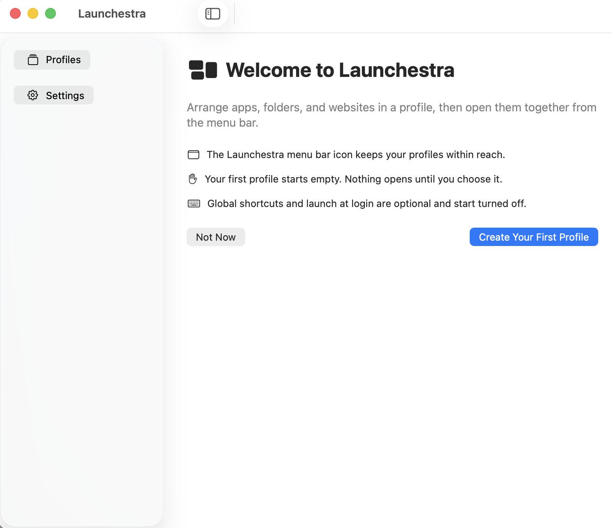
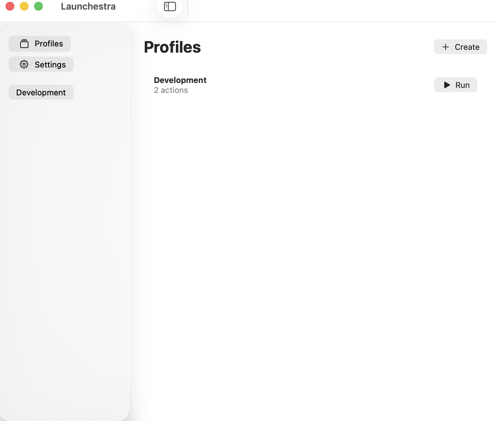
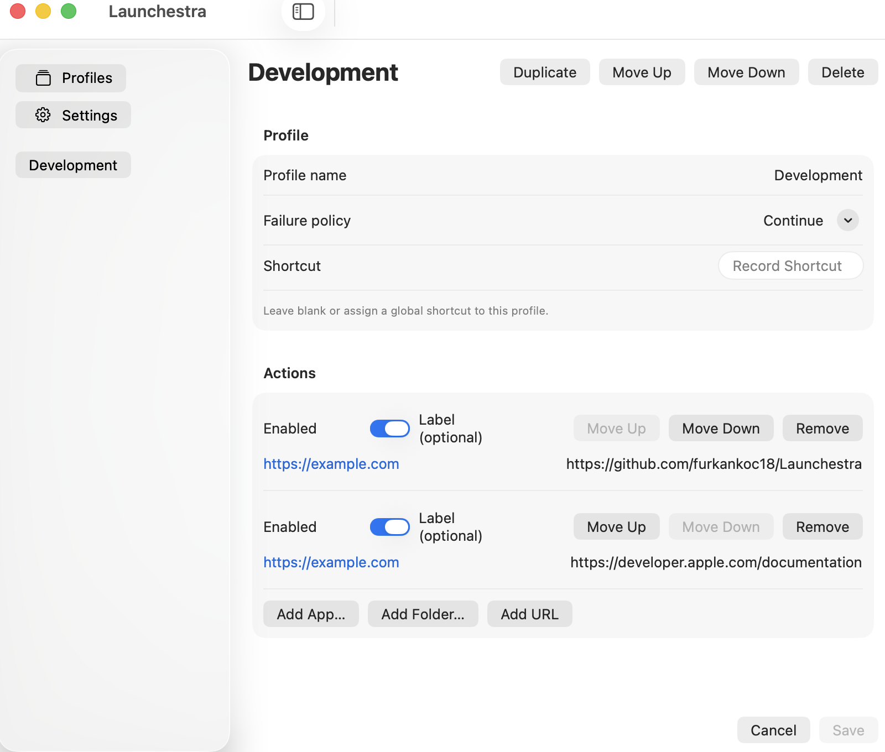
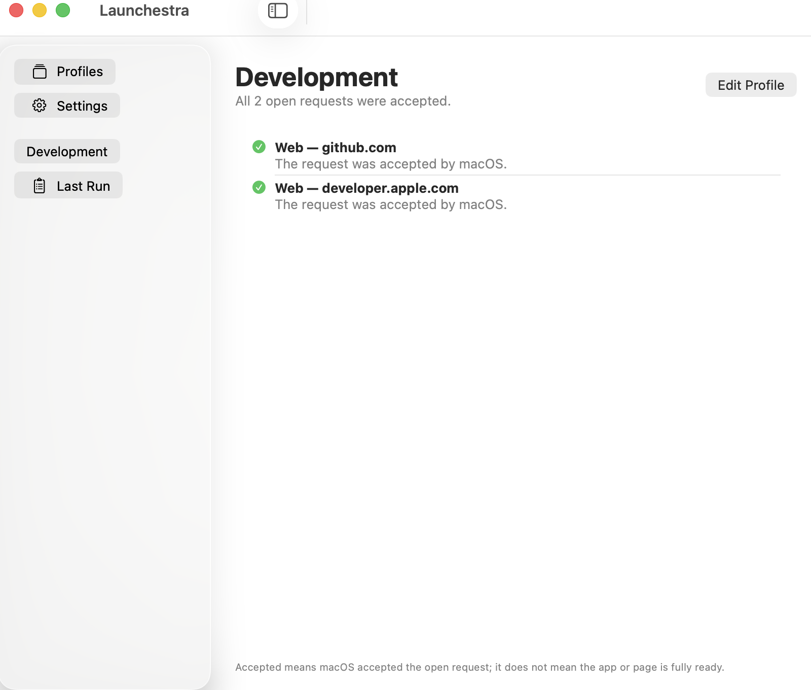

# Launchestra

Launchestra is an open source macOS menu bar app that prepares your MacBook workspace with one click. Add applications, folders, and web addresses to a profile, then Launchestra opens them in order and reports the result of every request.



## Features

- Create, duplicate, reorder, and delete workspace profiles
- Add applications, folders, and HTTP(S) addresses to a profile
- Run profiles from the menu bar
- Assign an optional global keyboard shortcut to each profile
- Show progress and cancel actions that have not started yet
- Distinguish accepted, partial, failed, timed out, and cancelled runs
- Start Launchestra at login without automatically running a profile
- Use the app in English or Turkish, with light and dark appearance support
- Store versioned JSON locally, maintain a verified backup, and provide an explicit recovery flow
- Work without an account, server, telemetry, or an in-app AI service

Launchestra sends open requests through macOS APIs. An accepted request means macOS accepted it; it does not prove that the target application or web page is fully ready.

## Screenshots

| Profiles | Profile editor |
| --- | --- |
|  |  |

| Run result | Welcome screen in dark mode |
| --- | --- |
|  |  |

The screenshots are generated with a synthetic profile in a UI test. They do not contain a real user directory, bookmark data, or URL query values.

## Requirements

To run the app:

- An Apple Silicon Mac
- macOS 14 Sonoma or later

To build from source:

- Xcode 26.1.1
- The Swift 6 toolchain
- Git
- An internet connection during the first build so Xcode can fetch KeyboardShortcuts

The deployment target is macOS 14. Physical validation has been performed on a Mac16,7 running macOS 26.6.2. A physical macOS 14 run is still pending; see the [performance and device matrix](docs/18-PERFORMANCE-AND-DEVICE-MATRIX.md).

## Installation

A public Developer ID signed and notarized package is not available yet. Building from source is currently the trusted installation method.

### 1. Clone the repository

Open Terminal and run:

```bash
git clone https://github.com/furkankoc18/Launchestra.git
cd Launchestra
```

To build the exact beta source revision:

```bash
git checkout v0.1.0-beta.1
```

Skip the checkout command if you want the latest development version from `main`.

### 2. Build the app

```bash
DEVELOPER_DIR=/Applications/Xcode.app/Contents/Developer \
  xcodebuild -project DeskMode.xcodeproj \
  -scheme DeskMode \
  -configuration Debug \
  -destination 'platform=macOS,arch=arm64' \
  -derivedDataPath .build/xcode \
  build
```

The first build downloads the pinned KeyboardShortcuts 3.0.1 package. After a successful build, the app is available at:

```text
.build/xcode/Build/Products/Debug/Launchestra.app
```

### 3. Open Launchestra

```bash
open .build/xcode/Build/Products/Debug/Launchestra.app
```

Launchestra is a menu bar app. It does not keep an icon in the Dock. Look for the Launchestra icon in the macOS menu bar at the top of the screen. The management window also appears on first launch.

### 4. Optionally copy it to your user Applications folder

If you want a stable path for the locally built app:

```bash
mkdir -p "$HOME/Applications"
ditto .build/xcode/Build/Products/Debug/Launchestra.app \
  "$HOME/Applications/Launchestra.app"
open "$HOME/Applications/Launchestra.app"
```

Repeat the copy command after building a new version. If Launchestra is already running, select **Quit Launchestra** from its menu first.

## Run from Xcode

You can also build and run the app entirely from Xcode:

1. Open `DeskMode.xcodeproj` in Xcode.
2. Select the `DeskMode` scheme in the toolbar.
3. Choose **My Mac** as the run destination.
4. Select **Product → Run** or press `⌘R`.
5. After launch, look for the Launchestra icon in the macOS menu bar.

The internal Xcode target and scheme retain the `DeskMode` name for compatibility. The generated application and executable are named `Launchestra`.

## Getting started

### Create a profile

1. Select **Create Your First Profile** on the welcome screen. If you skipped the guide, open **Profiles** and select **Create**.
2. Enter a name such as `Development`, `Design`, or `Morning Routine`.
3. Choose a failure policy:
   - **Continue:** Attempt the remaining actions after one action fails.
   - **Stop on first failure:** Do not start the remaining actions after the first failure.
4. Optionally record a global shortcut for the profile.
5. Add actions and select **Save**.

### Add actions

The profile editor supports three action types:

- **Add Application:** Select an installed `.app` bundle.
- **Add Folder:** Select a folder to open in Finder. Launchestra uses macOS bookmark data so it can resolve the folder after a move when possible.
- **Add URL:** Enter an address beginning with `http://` or `https://`.

Actions run in their saved order. Use **Up** and **Down** to reorder them. Turn off an action to keep it in the profile without running it.

### Run a profile

Select **Run** on the Profiles screen, choose the profile from the menu bar, or use its assigned global shortcut while Launchestra is in the background.

During a run:

- A second profile cannot start at the same time.
- **Cancel** prevents actions that have not started yet from running.
- Applications, folders, or browser tabs that already opened are not closed.
- Failed actions are not retried automatically.

The result screen marks each action as accepted, failed, timed out, or cancelled. URL results omit sensitive query and fragment values.

## Settings and permissions

When **Launch at Login** is enabled, Launchestra starts after the macOS user session begins. It does not automatically run any profile.

Version 0.1 does not request Accessibility, Screen Recording, or microphone permission. Application and folder selection use standard macOS selection panels. If a folder becomes unavailable, Launchestra reports the error or offers recovery instead of silently opening another path.

## Data and backups

Profiles are stored locally at:

```text
~/Library/Application Support/DeskMode/
```

The internal `DeskMode` directory name is retained for compatibility with earlier development builds. The main files are:

- `profiles.json`: Active profile data
- `profiles.backup.json`: Last verified backup
- `profiles.recovery-*`: Safety copies created before a user-approved recovery operation

The profile file may contain application and folder references as well as URLs. Remove real paths, URL query values, and bookmark data before sharing a bug report. See [PRIVACY.md](PRIVACY.md) and the [data model](docs/06-DATA-MODEL.md) for the complete storage contract.

## Troubleshooting

### Launchestra opened, but no window is visible

Launchestra continues running in the menu bar. Select its menu bar icon, then choose **Manage Profiles…** or **Settings…**.

### Xcode reports an SDK or `xcode-select` error

Make sure the command starts with `DEVELOPER_DIR=/Applications/Xcode.app/Contents/Developer`. If Xcode is installed elsewhere, update that path to match your installation.

### Package dependency resolution fails

Check your internet connection and resolve packages again:

```bash
DEVELOPER_DIR=/Applications/Xcode.app/Contents/Developer \
  xcodebuild -resolvePackageDependencies \
  -project DeskMode.xcodeproj \
  -scheme DeskMode
```

### An application or folder does not open

Select the target again in the profile editor and save the profile. The application may have moved, the disk may have been disconnected, or macOS may have denied access. The last run screen identifies the action that failed.

### Launch at Login does not work

Turn **Launch at Login** off and on again. Open **System Settings → General → Login Items & Extensions** and confirm that Launchestra is allowed.

## Build and test

Run the local CI equivalent:

```bash
DEVELOPER_DIR=/Applications/Xcode.app/Contents/Developer scripts/verify.sh
```

The script runs the Swift package tests with warnings treated as errors, using the pinned KeyboardShortcuts 3.0.1 dependency, and builds the unsigned arm64 app.

Run the UI tests with:

```bash
DEVELOPER_DIR=/Applications/Xcode.app/Contents/Developer \
  xcodebuild -project DeskMode.xcodeproj \
  -scheme DeskMode \
  -configuration Debug \
  -destination 'platform=macOS,arch=arm64' \
  -derivedDataPath .build/ui \
  -parallel-testing-enabled NO \
  test
```

Run only the documentation screenshot test with:

```bash
DEVELOPER_DIR=/Applications/Xcode.app/Contents/Developer \
  xcodebuild -project DeskMode.xcodeproj \
  -scheme DeskMode \
  -configuration Debug \
  -destination 'platform=macOS,arch=arm64' \
  -derivedDataPath .build/docs-screenshots \
  -parallel-testing-enabled NO \
  -only-testing:DeskModeUITests/DeskModeUITests/testDocumentationScreenshots \
  test
```

The CI definition is in [.github/workflows/ci.yml](.github/workflows/ci.yml). Development environment details are in [docs/10-DEVELOPMENT.md](docs/10-DEVELOPMENT.md).

## Architecture

- `App/`: SwiftUI and AppKit application shell, menu bar UI, and localization
- `Packages/DeskModeKit/Sources/DeskModeCore/`: AppKit-independent data model, validation, and execution contracts
- `Packages/DeskModeKit/Sources/DeskModePlatform/`: Repository actor, bookmark, NSWorkspace, shortcut, login item, and diagnostics adapters
- `Tests/DeskModeUITests/`: Signed application UI and end-to-end regression tests
- `docs/`: Product, UX, data, architecture, test, security, and release documents
- `TODO.md` and `STATUS.md`: Verified progress and remaining external dependencies

All file writes pass through one repository actor. The UI runs on MainActor. The execution engine accepts only one active run and keeps AppKit dependencies outside the domain layer. See the [architecture document](docs/05-ARCHITECTURE.md) for diagrams and design decisions.

## Current limitations

Launchestra 0.1 does not provide:

- Shell or terminal command execution
- AppleScript execution
- Window or display arrangement
- Audio device switching
- Automatic profile triggers based on display, location, or time
- Cloud sync or user accounts

These boundaries are tracked in the [PRD](docs/03-PRD.md) and [roadmap](docs/11-ROADMAP.md).

## Contributing, security, and license

Before contributing, read [CONTRIBUTING.md](CONTRIBUTING.md), the [PRD](docs/03-PRD.md), and [TODO.md](TODO.md). Follow [SECURITY.md](SECURITY.md) before reporting a vulnerability in a public issue.

The source code is available under the [MIT License](LICENSE). The KeyboardShortcuts notice is in [THIRD_PARTY_NOTICES.md](THIRD_PARTY_NOTICES.md).

## Release status

Version `0.1.0`, build `1`, and the source tag `v0.1.0-beta.1` are prepared. A public downloadable beta is pending a Developer ID Application certificate and Apple notarization. Current evidence and remaining release gates are recorded in [STATUS.md](STATUS.md).
