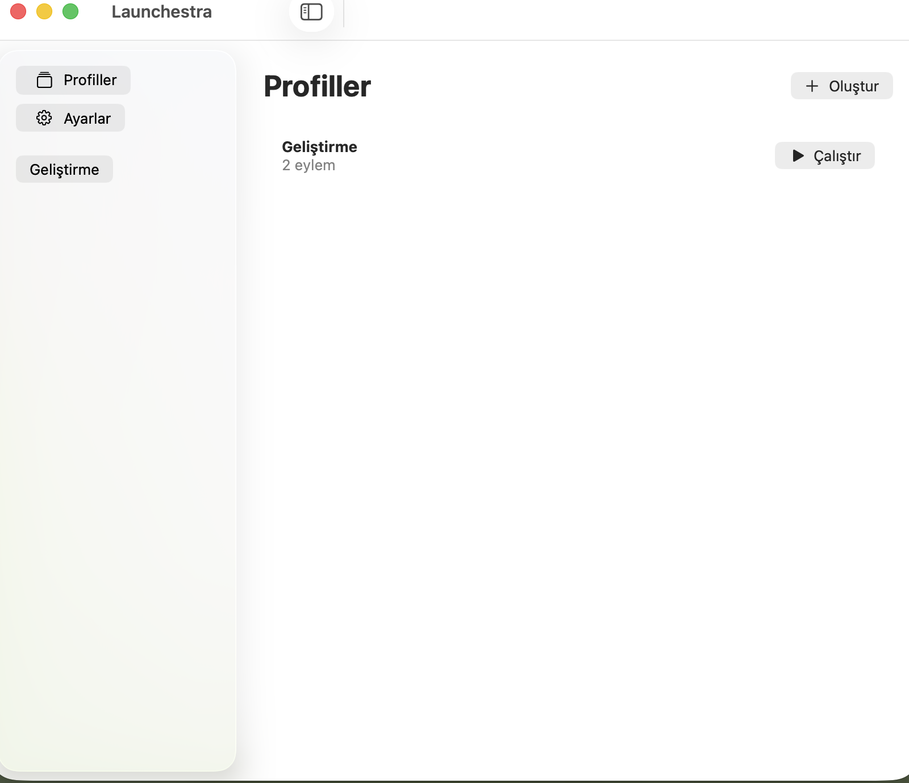
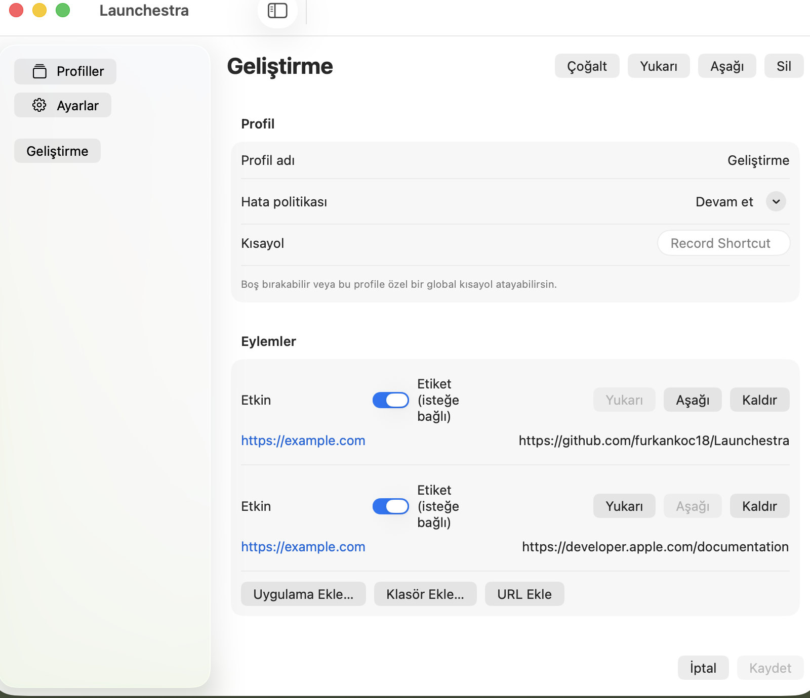
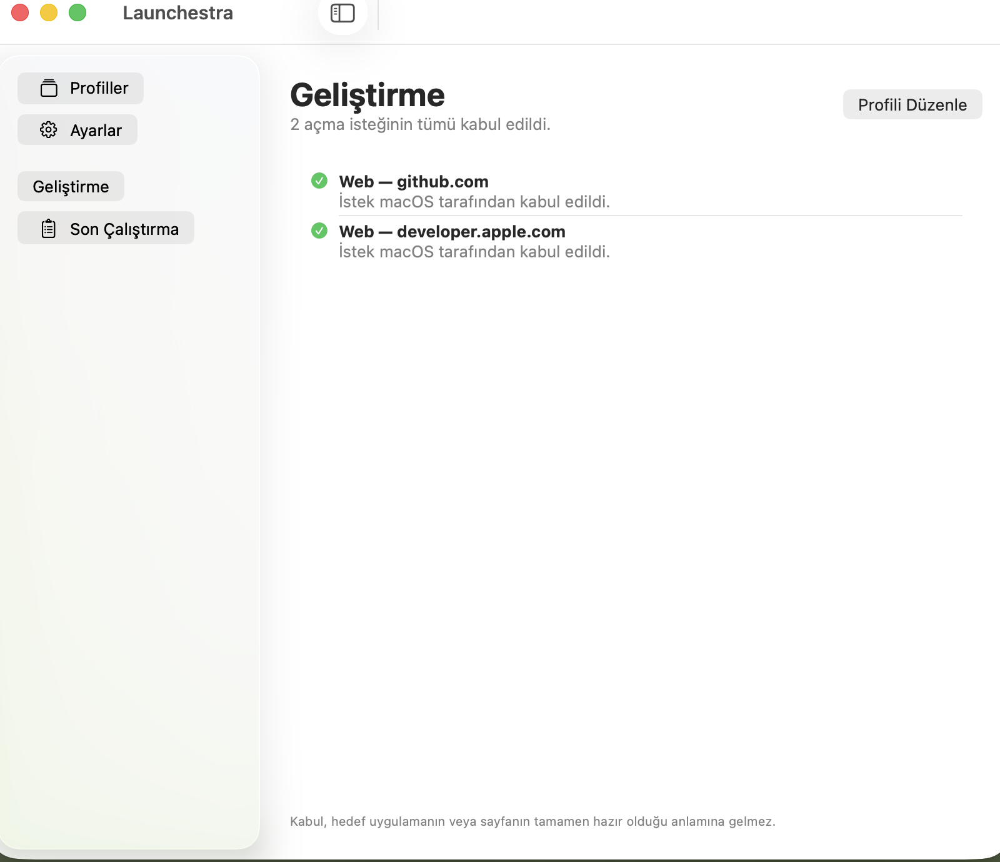

# Launchestra

Launchestra, MacBook'taki çalışma ortamlarını tek seçimle hazırlayan açık kaynak bir macOS menü çubuğu uygulamasıdır. Bir profile uygulamalar, klasörler ve web adresleri eklersin; Launchestra bunları kayıt sırasıyla açar ve her isteğin sonucunu gösterir.


## Özellikler

- Birden fazla çalışma profili oluşturma, çoğaltma, sıralama ve silme
- Profile uygulama, klasör ve HTTP(S) adresi ekleme
- Profili menü çubuğundan çalıştırma
- Her profil için isteğe bağlı global klavye kısayolu
- Bir anda tek profil çalıştırma, ilerleme gösterme ve kalan adımları iptal etme
- Kabul, kısmi başarı, hata, zaman aşımı ve iptal sonuçlarını ayrı gösterme
- İsteğe bağlı olarak macOS oturumu açıldığında Launchestra'yı başlatma
- Türkçe ve İngilizce arayüz; açık ve koyu görünüm desteği
- Sürümlü yerel JSON depolama, doğrulanmış yedek ve açık veri kurtarma akışı
- Hesap, sunucu, telemetri ve uygulama içi yapay zekâ bağımlılığı olmadan yerel çalışma

Launchestra yalnızca macOS'un açma API'lerine istek gönderir. Bir isteğin kabul edilmesi, hedef uygulamanın veya web sayfasının tamamen hazır olduğu anlamına gelmez.

## Ekran görüntüleri

| Profiller | Profil düzenleyici |
| --- | --- |
|  |  |

| Çalıştırma sonucu | Koyu görünüm ve İngilizce |
| --- | --- |
|  |  |

Görseller UI testinin sentetik profiliyle üretilmiştir. Gerçek kullanıcı klasörü, bookmark verisi veya URL sorgu değeri içermez.

## Sistem gereksinimleri

Uygulamayı çalıştırmak için:

- Apple Silicon işlemcili bir Mac
- macOS 14 Sonoma veya üstü

Kaynak koddan derlemek için ayrıca:

- Xcode 26.1.1
- Swift 6 araç zinciri
- Git
- KeyboardShortcuts bağımlılığını ilk derlemede indirmek için internet bağlantısı

Minimum hedef macOS 14'tür. Mevcut fiziksel doğrulama Mac16,7 üzerinde macOS 26.6.2 ile yapılmıştır; macOS 14 fiziksel cihaz koşusu henüz beklemektedir. Ayrıntılar [performans ve cihaz matrisi](docs/18-PERFORMANCE-AND-DEVICE-MATRIX.md) içindedir.

## Kurulum

Şu anda Developer ID ile imzalanmış ve notarize edilmiş herkese açık bir paket bulunmuyor. Bu nedenle mevcut güvenilir kurulum yöntemi kaynak koddan derlemedir.

### 1. Depoyu indir

Terminal'i aç ve şu komutları çalıştır:

```bash
git clone https://github.com/furkankoc18/Launchestra.git
cd Launchestra
```

Belirli beta kaynak kodunu kullanmak istersen:

```bash
git checkout v0.1.0-beta.1
```

Ana daldaki en güncel geliştirmeyi kullanmak için bu adımı atlayabilirsin.

### 2. Uygulamayı derle

```bash
DEVELOPER_DIR=/Applications/Xcode.app/Contents/Developer \
  xcodebuild -project DeskMode.xcodeproj \
  -scheme DeskMode \
  -configuration Debug \
  -destination 'platform=macOS,arch=arm64' \
  -derivedDataPath .build/xcode \
  build
```

İlk derleme KeyboardShortcuts 3.0.1 paketini indirir. Başarılı olduğunda uygulama şu konumda oluşur:

```text
.build/xcode/Build/Products/Debug/Launchestra.app
```

### 3. Launchestra'yı aç

```bash
open .build/xcode/Build/Products/Debug/Launchestra.app
```

Launchestra bir menü çubuğu uygulamasıdır. Dock'ta sürekli bir uygulama simgesi görünmez; ekranın üstündeki menü çubuğunda Launchestra simgesini ara. İlk açılışta yönetim penceresi de gösterilir.

### 4. İsteğe bağlı olarak kullanıcı Applications klasörüne kur

Her derlemeden sonra aynı yolu kullanmak istersen uygulamayı kullanıcı hesabındaki Applications klasörüne kopyalayabilirsin:

```bash
mkdir -p "$HOME/Applications"
ditto .build/xcode/Build/Products/Debug/Launchestra.app \
  "$HOME/Applications/Launchestra.app"
open "$HOME/Applications/Launchestra.app"
```

Yeni sürüm derlediğinde kopyalama komutunu yeniden çalıştır. Uygulama açıksa önce menüden **Launchestra'dan Çık** seçeneğini kullan.

## Xcode arayüzüyle çalıştırma

Terminal kullanmadan geliştirme yapmak için:

1. `DeskMode.xcodeproj` dosyasını Xcode ile aç.
2. Üst araç çubuğunda `DeskMode` scheme'ini seç.
3. Çalıştırma hedefini **My Mac** yap.
4. **Product → Run** seçeneğini kullan veya `⌘R` tuşlarına bas.
5. Uygulama açıldıktan sonra macOS menü çubuğundaki Launchestra simgesini kontrol et.

Proje içindeki hedef ve scheme adı geriye dönük uyumluluk için `DeskMode`, üretilen uygulama ve binary adı `Launchestra` olarak kalır.

## İlk kullanım

### Profil oluşturma

1. İlk açılış ekranında **İlk Profilini Oluştur** düğmesine bas. Rehberi geçtiysen **Profiller → Oluştur** yolunu kullan.
2. Örneğin `Geliştirme`, `Tasarım` veya `Sabah Rutini` gibi bir profil adı gir.
3. Hata politikasını seç:
   - **Devam et:** Bir eylem başarısız olsa bile sonraki eylemleri dener.
   - **İlk hatada dur:** İlk başarısız eylemden sonra kalan adımları çalıştırmaz.
4. İstersen bu profile özel bir global kısayol kaydet.
5. Eylemlerini ekle ve **Kaydet** düğmesine bas.

### Eylem ekleme

Profil düzenleyicide üç eylem türü vardır:

- **Uygulama Ekle:** Mac'teki bir `.app` paketi seçer.
- **Klasör Ekle:** Finder'da açılacak klasörü seçer. Launchestra klasörü taşınsa bile bulabilmek için macOS bookmark verisini kullanır.
- **URL Ekle:** Yalnızca `http://` veya `https://` ile başlayan adresleri kabul eder.

Eylemler kayıt sırasıyla çalışır. **Yukarı** ve **Aşağı** düğmeleriyle sıralamayı değiştirebilir, anahtarı kapatarak bir eylemi silmeden devre dışı bırakabilirsin.

### Profili çalıştırma

Profiller ekranındaki **Çalıştır** düğmesine veya menü çubuğundaki profil adına bas. Global kısayol atadıysan Launchestra arka plandayken de o kısayolu kullanabilirsin.

Çalıştırma sırasında:

- Aynı anda ikinci bir profil başlatılamaz.
- **İptal**, henüz başlamamış eylemleri durdurur.
- Daha önce açılmış uygulama, klasör veya sekmeler geri kapatılmaz.
- Başarısız adımlar otomatik olarak tekrar denenmez.

Sonuç ekranı her eylemi kabul edildi, başarısız, zaman aşımına uğradı veya iptal edildi şeklinde gösterir. URL sonuçlarında query ve fragment gibi hassas kısımlar gösterilmez.

## Ayarlar ve izinler

**Girişte başlat** açılırsa Launchestra macOS oturumu açıldığında çalışır. Bu seçenek herhangi bir profili kendiliğinden başlatmaz.

MVP sürümü Accessibility, ekran kaydı veya mikrofon izni istemez. Uygulama ve klasör seçimi standart macOS seçim panelleriyle yapılır. Bir klasör artık erişilebilir değilse Launchestra sessizce başka bir yola geçmez; kullanıcıya hata veya kurtarma seçeneği gösterir.

## Veri konumu ve yedekleme

Profiller bu Mac'te aşağıdaki dizinde tutulur:

```text
~/Library/Application Support/DeskMode/
```

İç dizin adının `DeskMode` olarak kalması önceki geliştirme kopyalarıyla veri uyumluluğunu korur. Temel dosyalar:

- `profiles.json`: Etkin profil verisi
- `profiles.backup.json`: Son doğrulanmış yedek
- `profiles.recovery-*`: Kullanıcı onayıyla yapılan kurtarma öncesi koruma kopyaları

Profil dosyası uygulama ve klasör tanımları ile URL'leri içerebilir. Hata bildirirken gerçek yolları, URL query değerlerini ve bookmark verisini paylaşma. Ayrıntılı veri davranışı [PRIVACY.md](PRIVACY.md) ve [veri modeli](docs/06-DATA-MODEL.md) içinde açıklanır.

## Sık karşılaşılan sorunlar

### Uygulama açıldı ama pencere görünmüyor

Launchestra menü çubuğunda çalışır. Üst menü çubuğundaki Launchestra simgesine basıp **Profilleri Yönet…** veya **Ayarlar…** seçeneğini aç.

### `xcode-select` veya SDK hatası alıyorum

Komutlarda `DEVELOPER_DIR=/Applications/Xcode.app/Contents/Developer` öneki bulunduğundan emin ol. Xcode farklı bir klasöre kurulduysa yolu kendi kurulumuna göre değiştir.

### Paket bağımlılığı indirilemiyor

İnternet bağlantısını kontrol et ve şu komutla paket çözümlemeyi yeniden çalıştır:

```bash
DEVELOPER_DIR=/Applications/Xcode.app/Contents/Developer \
  xcodebuild -resolvePackageDependencies \
  -project DeskMode.xcodeproj \
  -scheme DeskMode
```

### Bir uygulama veya klasör açılmıyor

Profil düzenleyicide hedefi yeniden seçip kaydet. Klasör taşınmış, disk çıkarılmış veya macOS erişimi reddetmiş olabilir. Son çalıştırma ekranındaki hata kodu sorunun hangi adımda olduğunu gösterir.

### Girişte başlatma çalışmıyor

**Ayarlar → Girişte başlat** seçeneğini kapatıp yeniden aç. macOS **Sistem Ayarları → Genel → Giriş Öğeleri ve Uzantılar** ekranında Launchestra'nın izinli olduğunu doğrula.

## Derleme ve test

Yerel CI eşini tek komutla çalıştır:

```bash
DEVELOPER_DIR=/Applications/Xcode.app/Contents/Developer scripts/verify.sh
```

Bu betik KeyboardShortcuts 3.0.1 kilitli bağımlılığıyla paket testlerini warnings-as-errors modunda çalıştırır ve unsigned arm64 uygulamayı derler.

UI testlerini çalıştırmak için:

```bash
DEVELOPER_DIR=/Applications/Xcode.app/Contents/Developer \
  xcodebuild -project DeskMode.xcodeproj \
  -scheme DeskMode \
  -configuration Debug \
  -destination 'platform=macOS,arch=arm64' \
  -derivedDataPath .build/ui \
  -parallel-testing-enabled NO \
  test
```

Dokümantasyon ekran görüntülerini oluşturan tek testi çalıştırmak için:

```bash
DEVELOPER_DIR=/Applications/Xcode.app/Contents/Developer \
  xcodebuild -project DeskMode.xcodeproj \
  -scheme DeskMode \
  -configuration Debug \
  -destination 'platform=macOS,arch=arm64' \
  -derivedDataPath .build/docs-screenshots \
  -parallel-testing-enabled NO \
  -only-testing:DeskModeUITests/DeskModeUITests/testDocumentationScreenshots \
  test
```

CI tanımı [.github/workflows/ci.yml](.github/workflows/ci.yml), geliştirme ortamının ayrıntıları [docs/10-DEVELOPMENT.md](docs/10-DEVELOPMENT.md) içindedir.

## Mimari

- `App/`: SwiftUI/AppKit uygulama kabuğu, menü çubuğu arayüzü ve yerelleştirme
- `Packages/DeskModeKit/Sources/DeskModeCore/`: AppKit'ten bağımsız veri modeli, doğrulama ve çalıştırma sözleşmeleri
- `Packages/DeskModeKit/Sources/DeskModePlatform/`: Repository actor, bookmark, NSWorkspace, kısayol, login item ve tanılama adaptörleri
- `Tests/DeskModeUITests/`: İmzalı uygulama üzerinden UI ve uçtan uca regresyonlar
- `docs/`: Ürün, UX, veri, mimari, test, güvenlik ve yayın belgeleri
- `TODO.md` ve `STATUS.md`: Kanıtlanmış ilerleme ve açık dış bağımlılıklar

Dosya yazımı tek repository actor üzerinden yürür. UI MainActor üzerindedir. Çalıştırma motoru bir anda yalnız bir run kabul eder ve AppKit bağımlılıklarını domain kodundan ayrı tutar. Ayrıntılı diyagram ve kararlar [mimari belgesinde](docs/05-ARCHITECTURE.md) yer alır.

## Mevcut sınırlar

Launchestra v0.1 şu özellikleri içermez:

- Shell veya terminal komutu çalıştırma
- AppleScript
- Pencere veya ekran yerleşimi
- Ses cihazı değiştirme
- Monitör, konum veya zamana göre otomatik profil tetikleme
- Bulut eşitleme veya hesap sistemi

Bu sınırlar [PRD](docs/03-PRD.md) ve [yol haritasında](docs/11-ROADMAP.md) izlenir.

## Katkı, güvenlik ve lisans

Katkı göndermeden önce [CONTRIBUTING.md](CONTRIBUTING.md), ürün kapsamı için [PRD](docs/03-PRD.md) ve görevler için [TODO.md](TODO.md) dosyasını oku. Güvenlik açığını public issue içinde ayrıntılandırmadan [SECURITY.md](SECURITY.md) yönergesini izle.

Kaynak kod [MIT Lisansı](LICENSE) ile lisanslanır. KeyboardShortcuts bildirimi [THIRD_PARTY_NOTICES.md](THIRD_PARTY_NOTICES.md) içindedir.

## Yayın durumu

Sürüm `0.1.0`, build `1` ve kaynak etiketi `v0.1.0-beta.1` olarak hazırlanmıştır. Developer ID Application sertifikası ve notarization tamamlanmadığı için herkese açık indirilebilir paketin resmî beta olarak sunulması beklemektedir. Güncel kanıt ve açık kapılar [STATUS.md](STATUS.md) dosyasında tutulur.
