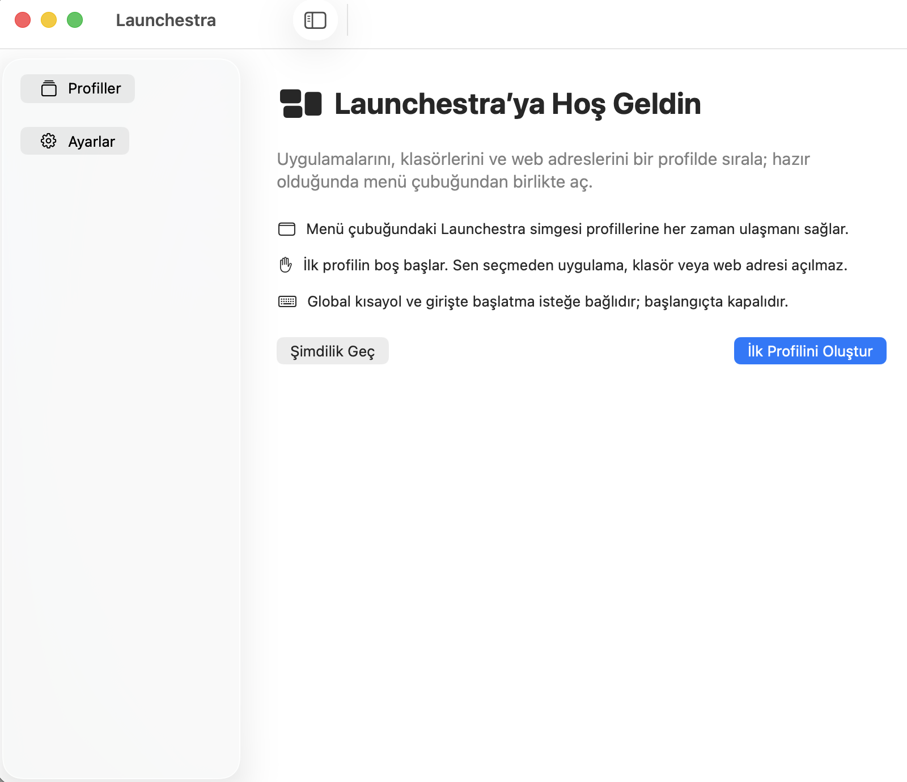

# Launchestra

Launchestra, MacBook'ta çalışma bağlamlarını tek seçimle açan yerel bir macOS menü çubuğu uygulamasıdır. Bir profile uygulama, klasör ve HTTP(S) adresleri eklersin; Launchestra bunları kayıt sırasıyla açar ve her isteğin sonucunu gösterir.



## Neler yapar?

- Profil oluşturur, çoğaltır, sıralar ve siler.
- Her profile `.app`, klasör ve web adresi eylemleri ekler.
- Profili menü çubuğundan veya isteğe bağlı global kısayoldan çalıştırır.
- Bir anda yalnız bir profil çalıştırır; kalan adımları iptal edebilir.
- Sonucun kabul, kısmi başarı, hata, zaman aşımı ve iptal durumlarını gösterir.
- Profil verisini bu Mac'te sürümlü JSON olarak tutar ve bozuk dosyayı sessizce sıfırlamaz.
- İsteğe bağlı olarak macOS girişinde başlar; başlangıçta hiçbir profili kendiliğinden çalıştırmaz.
- Türkçe ve İngilizce arayüz, klavye kullanımı, açık/koyu görünüm desteği sunar.

Launchestra hesap, sunucu, telemetri veya uygulama içi yapay zekâ servisi kullanmaz. Terminal komutu, AppleScript, ekran/pencere yerleşimi, ses cihazı yönetimi ve monitöre göre otomatik tetikleme v0.1 kapsamında değildir.

## Sistem gereksinimleri

- macOS 14 veya üstü
- Apple Silicon Mac
- Kaynaktan geliştirme için Xcode 26.1.1 ve Swift 6

Minimum hedef macOS 14'tür. Mevcut fiziksel doğrulama Mac16,7 üzerinde macOS 26.6.2 ile yapılmıştır; macOS 14 fiziksel cihaz koşusu henüz beklemektedir. Ayrıntı: [performans ve cihaz matrisi](docs/18-PERFORMANCE-AND-DEVICE-MATRIX.md).

## Çalıştırma

Uygulamanın güncel yerel Debug kopyasını oluşturmak için:

```bash
git clone <yayın-sonrası-depo-adresi>
cd DeskMode
DEVELOPER_DIR=/Applications/Xcode.app/Contents/Developer \
  xcodebuild -project DeskMode.xcodeproj -scheme DeskMode \
  -configuration Debug -destination 'platform=macOS,arch=arm64' \
  -derivedDataPath .build/xcode build
open .build/xcode/Build/Products/Debug/Launchestra.app
```

Uzak depo henüz yayımlanmadığı için `git clone` satırındaki gerçek adres DM-029'da eklenecektir. Bu yerel çalışma klasöründeysen doğrudan `cd /Users/furkankoc/Desktop/projects/DeskMode` ile ikinci satırdan devam edebilirsin.

İlk açılış rehberinden **İlk Profilini Oluştur** seçilir. Profil adı girildikten sonra eylemler eklenir ve kaydedilir. Menü çubuğundaki Launchestra simgesinden profil başlatılır. macOS açma isteğini kabul ettiğinde Launchestra bunu hedef uygulamanın tamamen hazır olduğu şeklinde yorumlamaz.

## Derleme ve test

Yerel CI eşini tek komutla çalıştır:

```bash
DEVELOPER_DIR=/Applications/Xcode.app/Contents/Developer scripts/verify.sh
```

Bu komut KeyboardShortcuts 3.0.1 kilitli bağımlılığıyla 71 paket testini warnings-as-errors modunda çalıştırır ve unsigned arm64 uygulamayı derler. UI regresyonu Xcode GUI test runner'ı gerektirdiği için ayrı çalışır:

```bash
DEVELOPER_DIR=/Applications/Xcode.app/Contents/Developer \
  xcodebuild -project DeskMode.xcodeproj -scheme DeskMode \
  -configuration Debug -destination 'platform=macOS,arch=arm64' \
  -derivedDataPath .build/ui -parallel-testing-enabled NO test
```

CI tanımı [.github/workflows/ci.yml](.github/workflows/ci.yml) içindedir. Performans fixture ve koşu betikleri [scripts](scripts) dizinindedir. Geliştirme ortamının ayrıntıları [docs/10-DEVELOPMENT.md](docs/10-DEVELOPMENT.md) içinde tutulur.

## Veri ve gizlilik

Varsayılan profil dizini `~/Library/Application Support/DeskMode` olarak korunur. Bu iç yol önceki geliştirme kopyalarıyla veri uyumluluğu içindir; kullanıcıya görünen ad Launchestra'dır. Profil JSON'u uygulama/klasör tanımları ve URL'ler içerebilir. Sorun bildirirken gerçek yolları, URL query değerlerini ve bookmark verisini paylaşma.

[PRIVACY.md](PRIVACY.md) ürünün veri davranışını, [SECURITY.md](SECURITY.md) tehdit modelini ve güvenlik bildirim durumunu açıklar.

## Proje yapısı

- `App/`: SwiftUI/AppKit uygulama kabuğu ve yerelleştirme.
- `Packages/DeskModeKit/`: AppKit'ten ayrılmış domain modeli, repository actor, runner ve macOS adaptörleri.
- `Tests/DeskModeUITests/`: imzalı uygulama üzerinden UI ve uçtan uca regresyonlar.
- `docs/`: ürün, veri, mimari, test ve yayın sözleşmeleri.
- `TODO.md` ve `STATUS.md`: kanıtlanmış ilerleme ve açık dış bağımlılıklar.

`DeskMode` Xcode hedefi, Swift modülleri ve veri dizini uyumluluk için iç ad olarak kalır. Uygulama ürünü, binary, menü ve pencere adı Launchestra'dır; kalıcı bundle kimliği `io.github.furkankoc18.Launchestra` olarak belirlenmiştir.

## Katkı ve lisans

Katkıdan önce [CONTRIBUTING.md](CONTRIBUTING.md), kapsam için [PRD](docs/03-PRD.md) ve görevler için [TODO](TODO.md) okunmalıdır. Güvenlik açığını public issue içinde ayrıntılandırmadan [SECURITY.md](SECURITY.md) yönergesini izle.

Kaynak kod [MIT Lisansı](LICENSE) ile lisanslanır. KeyboardShortcuts bildirimi [THIRD_PARTY_NOTICES.md](THIRD_PARTY_NOTICES.md) içindedir.

Yayımlanmış ve Developer ID ile notarize edilmiş bir beta henüz yoktur. Yerel ad-hoc ZIP/DMG, resmî dağıtım veya Gatekeeper uyumlu yayın yerine geçmez.
