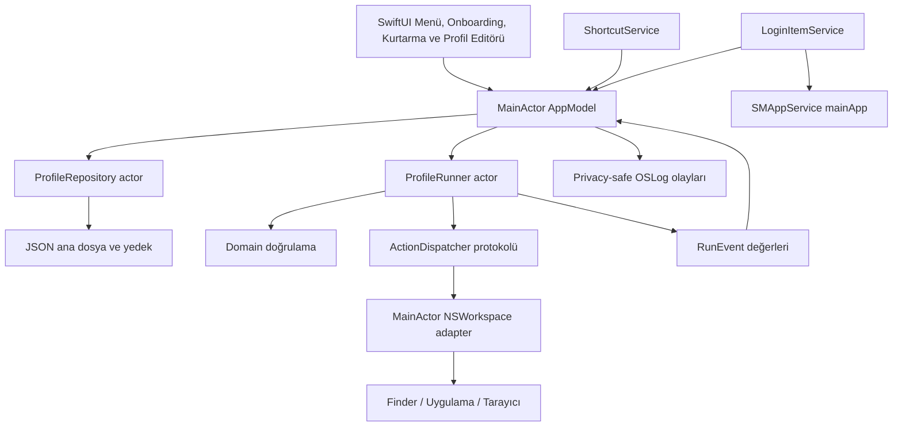

# Teknik mimari

## Karar

Tek süreçli yerel macOS uygulaması. SwiftUI sunum, AppKit sistem entegrasyonu, saf Swift çekirdek ve sürümlü JSON depolama. XPC servis, daemon, backend ve ağ istemcisi ilk sürüme gerekmez.



## Modül ve dosya planı

Aşağıdaki yapı DM-024 sonundaki gerçek mimariyi gösterir. Xcode projesi, Core model/runner sözleşmesi, Platform repository/workspace/kısayol/login-item/tanılama adaptörleri ile onboarding ve kurtarma dahil ürün arayüzü oluşturuldu.

```text
DeskMode.xcodeproj/              # App ve UI test scheme'leri, Git'e dahil
App/
  DeskModeApp.swift              # Composition root ve scene tanımları
  DeskModeShell.swift            # MainActor AppModel, menü, yönetim view/controller
  Features/
    Menu/  Profiles/  Settings/  Onboarding/  RunResults/
  Resources/Localizable.xcstrings
  Info.plist
  DeskMode.entitlements
Packages/DeskModeKit/
  Package.swift
  Sources/
    DeskModeCore/
      ProfileModels.swift  ProfileStoreValidator.swift  ProfileStoreCoding.swift
      ExecutionModels.swift  ProfileRunner.swift
    DeskModePlatform/
      JSONProfileRepository.swift  FolderReferenceService.swift
      WorkspaceDispatcher.swift  ShortcutExperiment.swift
      ProfileShortcutService.swift  LoginItemService.swift
      Diagnostics.swift                   # gizlilik sınırlı OSLog olayları
  Tests/
    DeskModeCoreTests/
    DeskModePlatformTests/
Tests/DeskModeUITests/
scripts/                        # verify, build ve paketleme; geliştirme sırasında
docs/                           # Bu paketteki belgeler
```

`DeskModeCore` Foundation dışında UI/system framework import etmez. `DeskModePlatform` Core'a bağlıdır. App ikisine bağımlıdır. Core, App veya Platform'a bağımlı olamaz. Üçüncü parti KeyboardShortcuts yalnız Platform sınırında tutulur; UI recorder gerekiyorsa dar bir Platform view üzerinden sunulur.

## Bileşen sözleşmeleri

| Bileşen | Sorumluluk | Yapmaması gereken |
| --- | --- | --- |
| AppModel | Görünen state, editör taslağı, kullanıcı niyeti, olay aboneliği | JSON yazmak, OS çağrılarını view içinde yapmak |
| ProfileRepository actor | Yükleme, doğrulama, revision kontrollü kaydetme, yedek | Profil çalıştırmak veya UI göstermek |
| ProfileValidator | Alan ve referans bütünlüğü, kapasite ve izinli türler | Dosya açma veya app launch |
| ProfileRunner actor | Tek run kilidi, snapshot, sıra, süre, iptal | AppKit nesnesi saklamak, veri dosyasını güncellemek |
| WorkspaceDispatcher | Tipli action'ı OS isteğine çevirme ve callback eşleme | Otomatik tekrar, shell fallback, hazır olma iddiası |
| ShortcutService | Aktif profillerin kısayol kaydı ve unregister | Tüm klavyeyi dinleme, ikinci bir kısayol deposu |
| LoginItemService | Gerçek SMAppService durumu ve kullanıcı isteği | UI switch değerini tek gerçek sayma |
| Diagnostics | Run/action ID, hata kodu ve süre | Ham URL, yol, bookmark, kullanıcı içeriği |

## Temel sınır tipleri

Örnek imzalar tasarım sözleşmesidir; SDK/Swift actor izolasyonuna göre derlenebilir ayrıntı DM-005/DM-009'da kesinleştirilir.

```swift
protocol ProfileRepository: Sendable {
    func load() async throws -> ProfileStore
    func save(_ next: ProfileStore, expectedRevision: Int) async throws -> ProfileStore
}

protocol ActionDispatching: Sendable {
    @MainActor func preflight(_ action: ProfileAction) async
        -> Result<PreparedAction, RunErrorCode>
    @MainActor func dispatch(
        _ action: PreparedAction,
        completion: @escaping @Sendable (Result<Void, RunErrorCode>) -> Void
    ) -> DispatchCancellation
}

// RunRequest kalıcı profile ait value snapshot içerir.
// ProfileRunner.run busy hatasını veya terminal RunResult değerini döndürür.
// eventStream yalnız Sendable değer tipleri taşır ve terminal olaydan sonra biter.
```

Repository protokol adı ile somut `JSONProfileRepository` actor ayrıdır. Platform `WorkspaceDispatcher` MainActor izole, bookmark çözümü ayrı `FolderReferenceService` actor'ındadır. UI state `@MainActor ObservableObject` AppModel'de tutulur; view'lar repository veya NSWorkspace çağırmaz.

## Eşzamanlılık

Runner `await` öncesinde busy durumunu ve run ID'yi yazar; actor reentrancy ikinci run'a kapı açmaz. İptal/bitiş işaretlemesi aynı otoritede olur. MainActor üzerinde disk I/O, senkron bekleme ve polling yapılmaz. Repository yazımları seri; optimistic revision taslak/yenileme çakışmalarını yakalar. Her sınırda `Sendable` değerler kullanılır; `@unchecked Sendable` ve concurrency denetimini kapatma varsayılan çözüm değildir.

NSWorkspace callback/timer/iptal yarışı tek tamamlanma kapısından geçer. Gecikmiş callback yalnız ait olduğu action/run hâlâ aktifse değerlendirilir. Ayrıntılar [çalıştırma motorunda](08-EXECUTION-ENGINE.md).

## Bağımlılıklar

Apple framework'leri dışında tek dependency [KeyboardShortcuts 3.0.1](https://github.com/sindresorhus/KeyboardShortcuts) olarak sabitlenmiş ve Package.resolved Git'e eklenmiştir. JSON repository Foundation, CryptoKit ve Darwin public API'lerini kullanır. Veritabanı, DI framework, analitik ve ağ katmanı eklenmez.

## Büyüme noktaları

V0.2 import/export ayrı taşınabilir şema ve açık kaynak eşleme UI'sı gerektirir. V0.3 ortam gözlemcisi yalnız profil önerisi üretir; aynı runner'a kullanıcı onaylı run gönderir. Ses/pencere adaptörleri eklenirse yeni action türü ve şema sürümüyle gelir. Gelecek özellikler için bugün boş interface/plugin altyapısı üretmek gerekmez.
