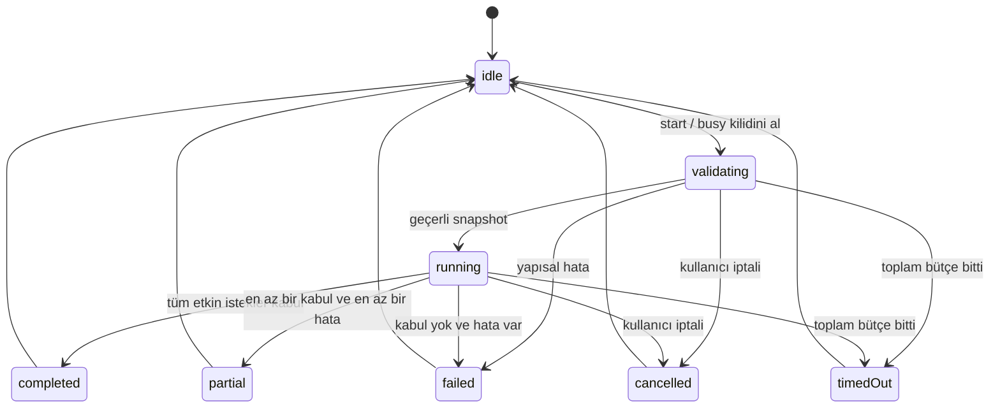

# Profil çalıştırma motoru

## Davranış

Motor kaydedilmiş bir profilin immutable snapshot'ını alır. Kaynakların çözülebilirliğini ön kontrolden geçirir; eylemleri array sırasıyla, aynı anda yalnız bir dispatch olacak şekilde çalıştırır. Her adım sonucu kaydedilir. İstek kabulü, hedef uygulamanın tamamen hazır olduğunun kanıtı değildir.

Tek run tüm uygulama genelinde geçerlidir. Başka profil çağrısı dahil ikinci başlatma busy döner; kuyruk oluşturmaz, mevcut run'ı kesmez. Kullanıcı isterse iptal eder ve sonra yeni profil başlatır.

## Durum modeli



Terminal RunResult UI'da tutulur; iç motor yeni run'a hazır `idle` durumuna döner. Olaylar `runID`, `actionID`, `sequence` taşır. UI yalnız kendi izlediği güncel run olaylarını işler.

| Eylem durumu | Anlam |
| --- | --- |
| pending | Henüz dispatch edilmedi |
| running | Platforma açma isteği gönderiliyor/cevap bekliyor |
| accepted | OS/adaptör isteği kabul etti |
| failed | Açık hata veya preflight kaynak hatası |
| timedOut | Sonuç bütçe içinde gelmedi; harici işlem yine gerçekleşebilir |
| skipped | Devre dışı veya stop politikasından dolayı çalıştırılmadı; reason alanı zorunlu |
| cancelled | Kullanıcı iptali nedeniyle sonucu beklenmeyen ya da başlatılmayan |

## Ön kontrol

Önce şema/alan doğrulama; sonra uygulama bundle çözümü, klasör bookmark çözümü ve URL allowlist kontrolü. Açma isteği, AppleEvent, ağ isteği veya harici program başlatma yoktur. Kaynak kontrolü advisory'dir; kaynak kontrol ile dispatch arasında kaybolursa action failed olur.

Yapısal hata tüm run'ı dispatch olmadan reddeder. Devre dışı action'ın yapısı geçerli olmalıdır ama kaynağı çözülmez. Etkin action kaynak hatası için `continue` politikası o adımı failed yapıp diğerlerine devam eder. `stop` politikasında herhangi bir etkin kaynak preflight hatası varsa **hiçbir eylem dispatch edilmez**, diğerleri skipped/preflightAborted olur. Bu davranış kullanıcıya sonuç listesinde açıklanır.

Toplam 60 saniyelik bütçe start kabulünde başlar ve preflight'ı içerir. Ağ volume'unun dosya erişimi takılabileceği için kaynak çözümü MainActor dışında çalışır; timeout/cancellation kapısı preflight için de geçerlidir. Harici bloklayan sistem çağrısı zorla öldürülmüş sayılmaz.

## Algoritma

```text
start(snapshot):
  if activeRun != nil: return busy
  atomik olarak runID ata ve activeRun kur
  startTime ve 60s toplam deadline kaydet
  snapshot yapısını doğrula; yapısal hata varsa failed ile bitir
  etkin kaynakları deadline/iptal gözeterek çöz
  stop + preflight hatası varsa dispatch etmeden failed ile bitir
  her action için:
    iptal/total deadline durumunu kontrol et
    disabled ise skipped(disabled)
    preflight hatalı ise failed; continue politikasında ilerle
    deadline = min(now + 10s, totalDeadline)
    tek tamamlanma kapısıyla dispatch / timeout / cancel yarışını bekle
    terminal action sonucunu tam bir kez yayımla
    failed veya action timeout + stop ise kalanları skipped(policyStopped) yap
  sonucu aşağıdaki öncelikle hesapla
  terminal run olayını bir kez yayımla; activeRun kilidini bırak
```

Sonuç önceliği: Kullanıcı iptali → cancelled; toplam deadline → timedOut; hata yok ve en az bir accepted → completed; accepted ve hata → partial; accepted yok ve hata → failed. Devre dışı adımlar başarı sayılmaz ve partial oluşturmaz. Tamamen boş/devre dışı profil invalid olarak reddedilir. Yalnız bir action timeout olması run'ı otomatik `timedOut` yapmaz; total deadline aşılmadıysa accepted sayısına göre partial/failed olur.

## Zaman aşımı ve iptal yarışı

NSWorkspace'in callback'i iptal edilebilir bir OS işi gibi modellenmez. Timeout yalnız Launchestra'nın beklemesini sonlandırır. Callback, timer ve cancellation aynı `completeOnce` kapısına gelir. İlk terminal sonuç kazanır; kalanlar no-op olur. Timer temizlenir, continuation en fazla bir kez resume edilir. AppKit callback'i MainActor dışında gelebilir; UI state orada değişmez.

`withTaskGroup` yarışı yazıp iptali desteklemeyen child'ın bitmesini sonsuza dek bekleyen bir uygulama kabul edilmez. Adaptörün kendi completion/deadline kapısı test edilmelidir. İptalden sonra eski callback yeni run'ın durumunu değiştiremez. Yalnız bu köprü katmanında gerekli izolasyon çözümü uygulanır; tüm projede concurrency kontrolü kapatılmaz.

Aktif OS isteği iptalden sonra tamamlanabilir. Launchestra bunu geri alamaz; run yeniden çalıştırıldığında aynı URL tekrar açılabilir. Otomatik retry, otomatik uygulama kapatma ve rollback yoktur. Yeniden deneme v0.1'de yalnız kullanıcının bütün profili tekrar başlatmasıdır; başarısız adımları tek tıkla tekrar etme kapsam dışıdır.

## Olay ve hata sözleşmesi

Olaylar: runStarted, validationFinished, actionStarted, actionFinished, runFinished. Her action için tek terminal olay; her run için tek runFinished. Sonuçlar en fazla 30 eylem içeren son run snapshot'ı olarak bellekte tutulur. Event stream bitirilir ve dinleyici abonelikleri temizlenir.

Hata kodları: invalidProfile, applicationNotFound, folderUnresolved, accessDenied, invalidURL, launchRejected, actionTimedOut, runTimedOut, cancelled, busy, storageUnavailable. Domain hataları kullanıcı dostu mesajlara UI katmanında çevrilir. Altta OS NSError domain/code tanılama için tutulabilir, ham localizedDescription hassas yol içerebileceğinden otomatik loglanmaz.

## Kabul örnekleri

- A kabul, B hata, C kabul; continue → partial, C dispatch edilir.
- A kabul, B runtime hata, C bekliyor; stop → partial, C skipped.
- B preflight hata; stop → failed, A dahil hiçbir action dispatch edilmez.
- 10 hızlı start çağrısı → 1 run, 9 busy.
- B beklerken iptal → A accepted kalır, B/C cancelled, uygulamalar kapatılmaz.
- B timeout sonrası callback → terminal sonucu ve sonraki run değişmez.
- Profil run sırasında düzenlenir → mevcut snapshot aynı kalır, bir sonraki run yeni veriyi kullanır.

## Uygulama kaydı — 2026-09-06

DM-009/010 ile sözleşme `ProfileRunner` actor ve yalnız Sendable değer taşıyan `ActionDispatching` sınırı olarak uygulandı. Busy kilidi ilk `await` öncesinde alınır. Preflight ve dispatch beklemeleri callback/timeout/cancel sonuçlarını bir `AsyncStream` kapısında yarıştırır; ilk değer alındıktan sonra stream bitirilir, timer iptal edilir ve cancellation aboneliği kaldırılır. Desteklemeyen child task'ı bekleyen task-group yarışı kullanılmaz.

Sahte dispatcher ve saat testleri continue/stop preflight ve runtime matrisini, disabled adımı, 1 run + 9 busy çağrıyı, iptal sırasında yeni dispatch yapılmamasını, callback gelmeyen action'ı, toplam preflight deadline'ını, geç callback sonrası yeni run'ı ve tek terminal event/bitmiş stream davranışını gerçek saniye beklemeden doğruladı. DM-015–017 ile AppModel bağlantısı, ortak busy/iptal kapısı, ilerleme ve yalnız bellekte tutulan güvenli sonuç görünümü ürün akışına eklendi. DM-018 profil listener'ları da aynı `AppModel.run(profileID:)` girişini çağırır; menü ve kısayol ayrı busy veya iptal state'i oluşturmaz.
